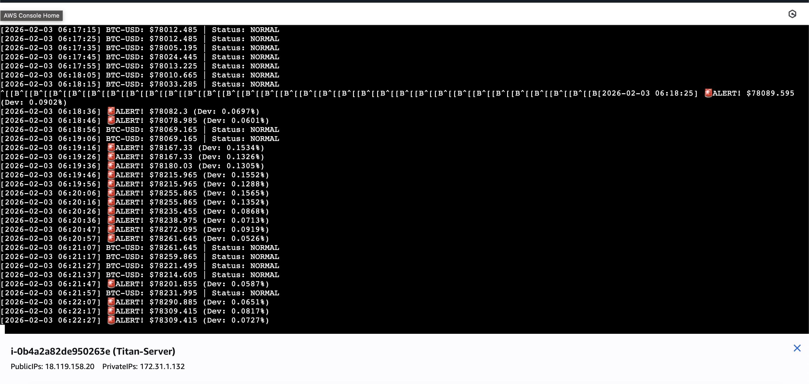

# Titan: My AWS Data Engine 

I built Titan because I wanted a way to track Bitcoin volatility 24/7 without having to keep my laptop open or a terminal window active all day. It’s a Python-based engine that lives on the cloud, watches the Coinbase API and flags price swings that look out of the ordinary.

### The Setup
The project is hosted on an **AWS EC2 (Ubuntu)** instance. Since I didn't want the script to die every time I closed my MacBook, I’m using a Linux tool called `screen`. This lets the engine run in the background 24/7, even while I'm away or my computer is off.

### What it actually does
* **Constant Monitoring:** It pings Coinbase every 10 seconds for the latest BTC-USD price.
* **Calculating "Normal":** Instead of just looking at the current price, it keeps a rolling average of the last 10 data points (using a `deque`) to understand the current trend.
* **Alerting on Volatility:** If a price moves more than 0.05% away from that rolling average, it triggers a `🚨ALERT` in the logs.
* **Logging:** Everything is saved to a local `titan_data.csv` on the server so I can go back and look at the market movement over long periods.

### Real-World Deployment
This isn't just running locally. Here is a shot of the engine active on my AWS instance. You can see my name in the console and the alerts it caught while I was away:

### What's in this Repo
* `main.py`: The production version of the engine with the anomaly logic.
* `titan_v1.py`: My first "proof of concept" script used for initial connectivity tests.
* `.gitignore`: Set up to keep my AWS `.pem` keys and data logs off the public internet.
